# Nom Veterinary Clinic Information System

## A VB.NET Desktop App that provides a software system that manages all the necessary information of the clinic establishment

* The desktop application was our case study program for Computer Programming 3
* It efficiently manages all the essential information of the clinic by handling pet owner profiles, pet profiles, booking system, and walk-in customer management using class OOP structrues and file management methods with text files.
* The user can create his/her own profile, register pets, and book an appointment for the pets' medical check-ups
* The program can be used both by the customer or the clinic's admin, The admin can handle sessions, view databases, and bill the pet owner after their pets' check-up.

## Instructions
### To use the app
* Download and run the [NOMVeterinaryClinic_Installer.exe](https://github.com/Aron-Arboleda/NomVet/blob/main/dist/NOMVeterinaryClinic_Installer.exe) file from the "dist" folder to access the app.
* it will redirect you to the installer file's directory in this repository. Click the download button on the right side, wait for a few seconds, and the download progress should pop up at the top. It will display a lot of caution and warning messages because i don't know for the life of me how to make the program to be recognized as a safe application (sorry i'm a noob at deploying apps) but just click the "keep anyway" button or anything else to continue downloading the file. Then when the file is downloaded, you can run the installer, then windows defender thing will pop up, saying it's not a safe file or something, just click "More info" and continue the application installment. Go through the installer and after that, the program should be installed on your end.

## Features still in development
* Bugs Fixing
* a secured database (the databases are currently .txt files)

## NOMVC Team
Front-end Designers:
* [Victoria](https://github.com/vic-7oria)
* [Mary](https://www.instagram.com/Marygiiil)
* [Janina](https://www.instagram.com/jhapplepi)

Back-end Handlers:
* [Aron](https://github.com/Aron-Arboleda)
* [Keazer](https://github.com/rezkae)

## Images

  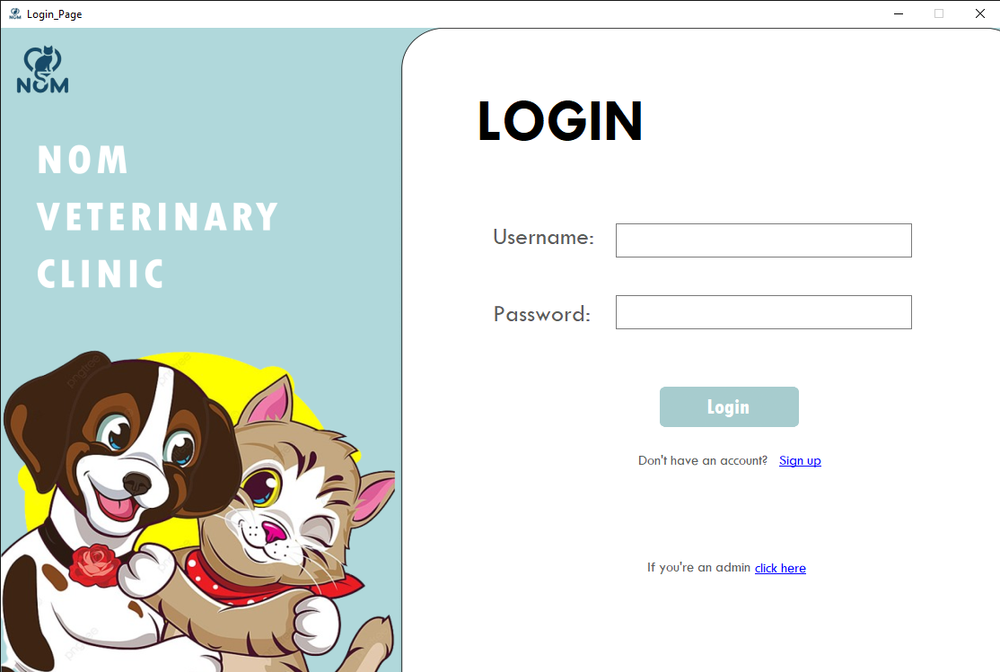
  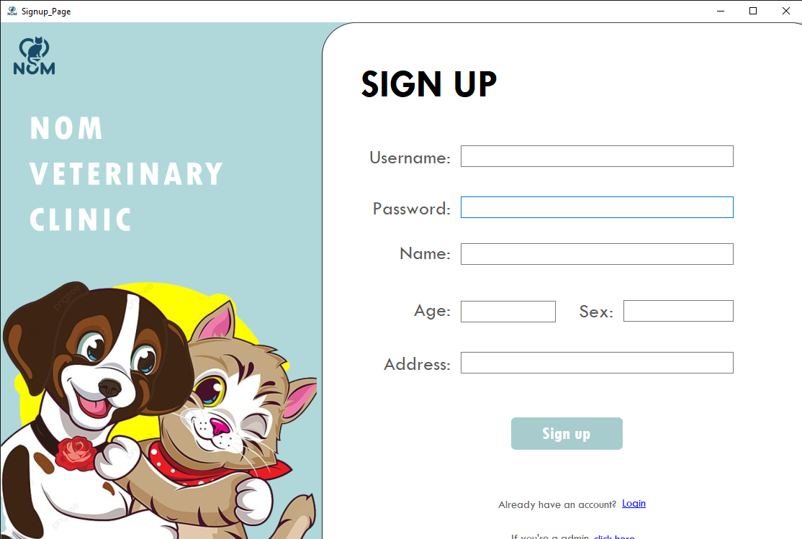

  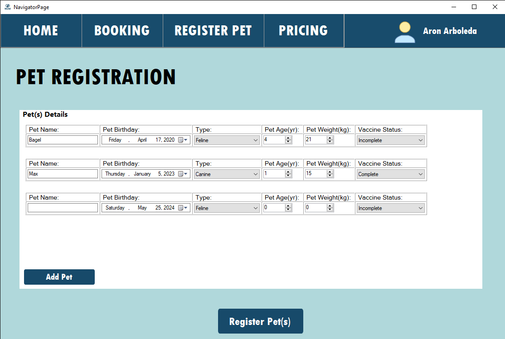
  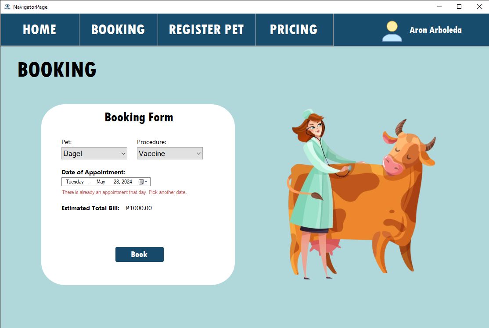

  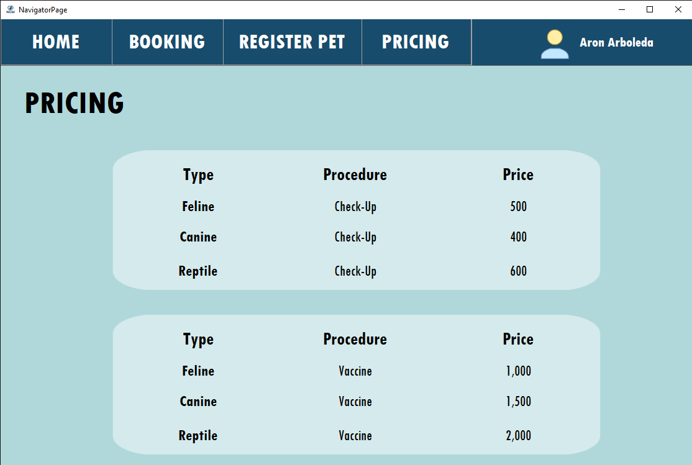
  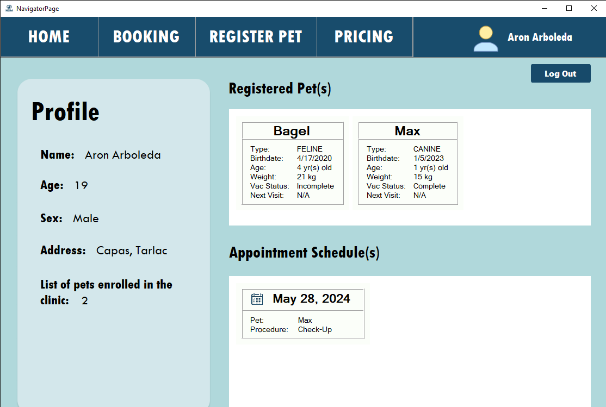

  
  

  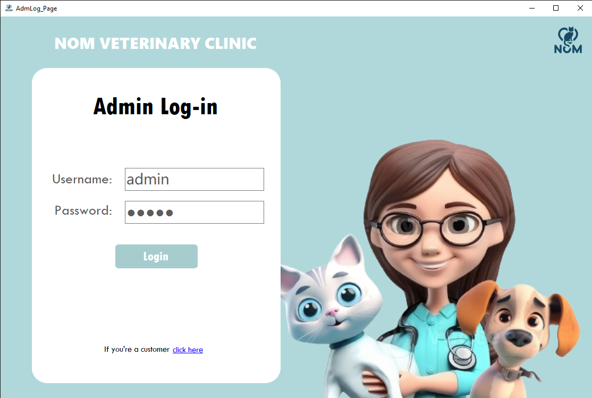
  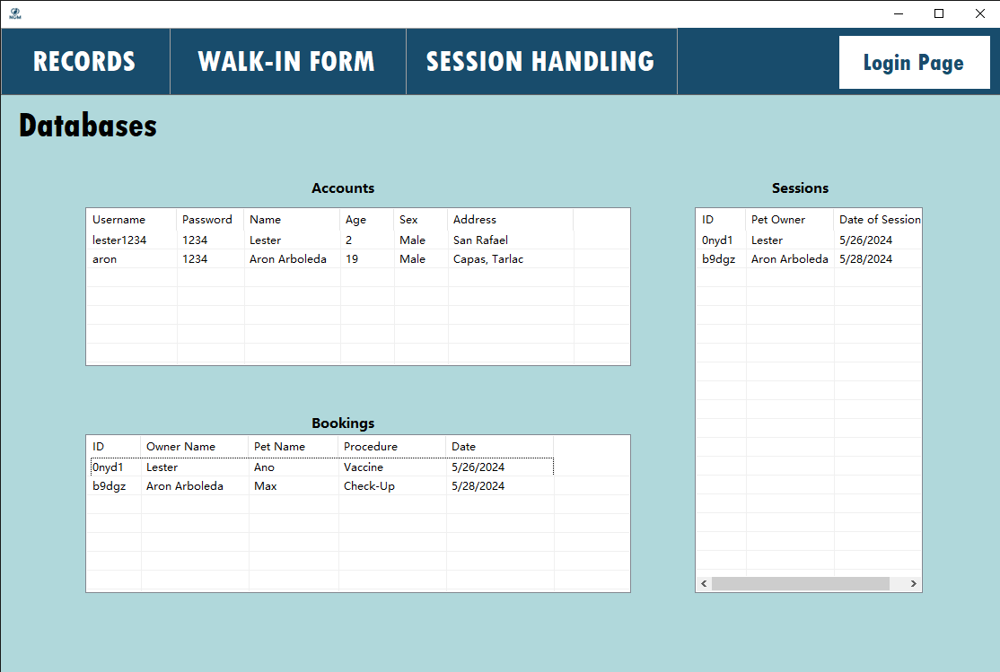

  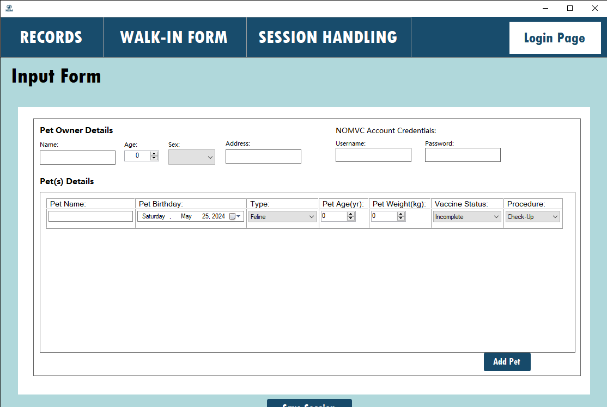
  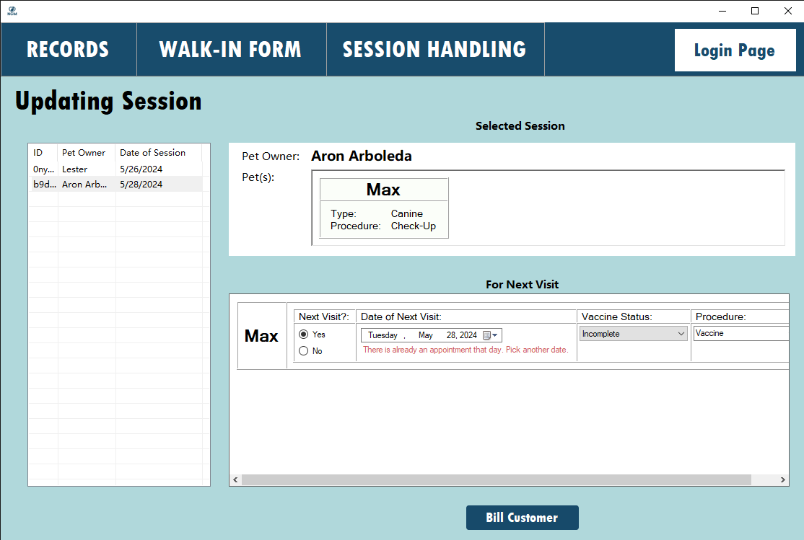

  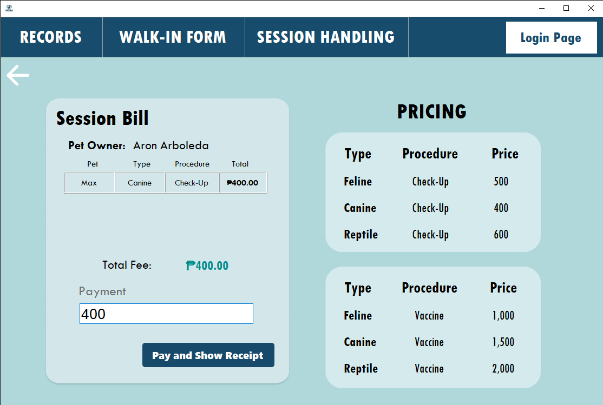
  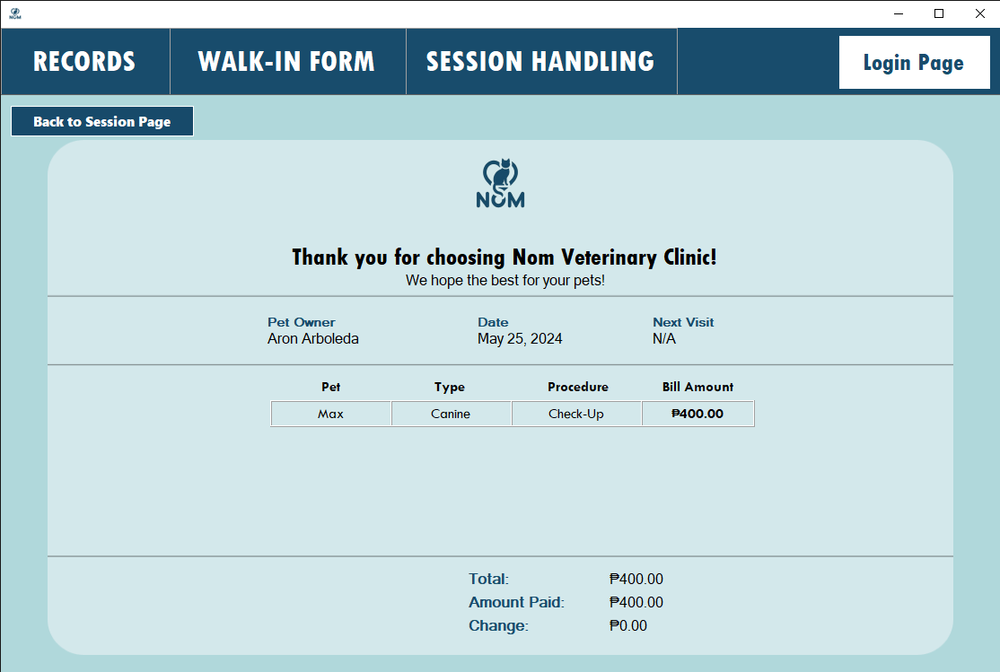

 &copy; 2024 Aron-Arboleda. All rights reserved.
